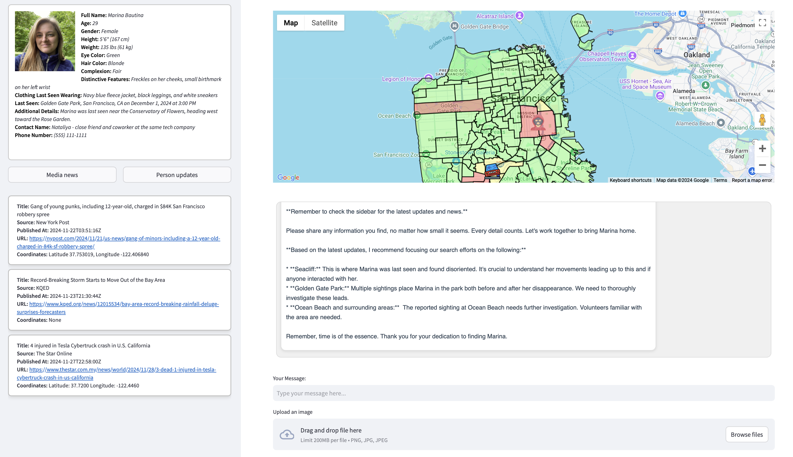
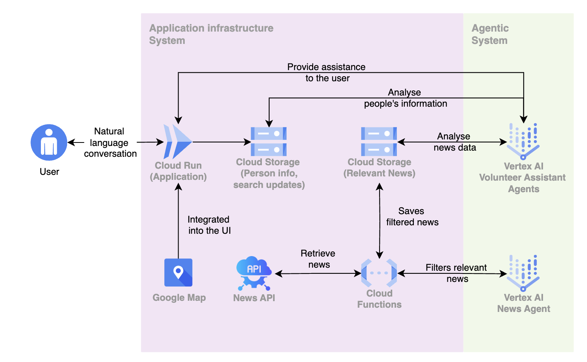

# People Search Assistant

This project introduces a system that utilizes advanced  GenAI technologies powered by Google Cloud Platform, along with real-time data insights, to assist in locating missing individuals. It was built for the [UC Berkeley RDI: LLM Agents Hackathon](https://uc-berkeley-rdi-llm-agents.devpost.com).





## Table of Contents
- [Features](#features)
- [Technologies Used](#technologies-used)
- [Installation](#installation)
  - [Local Installation](#local-installation)
  - [Using Docker](#using-docker)
---

## Features

- **Targeted search recommendations:**  delivers targeted recommendations to optimize search efforts with the use of Gemini 1.5 Pro
- **Monitors search progress:** integrates real-time updates with emerging news insights
- **Tracks activity visually:** features a color-coded map for dynamic, real-time monitoring
- **Identifies key events:** highlights critical news occurrences with precise geographic coordinates
- **Generates image insights:** analyzes visual data for actionable leads and timely updates upon request

---

## Technologies Used



In addition to the GCP stack solution, the following tools and technologies were utilized:
- **[Streamlit](https://streamlit.io/):** For building interactive web applications.
- **[News API](https://newsapi.org):** To fetch real-time news data.
- **[Docker](https://www.docker.com/):** For containerization and deployment.
---

## Installation

### Local Installation

1. **Clone the Repository:**
   ```bash
   git clone https://github.com/mbautina135/missing_ppl_search.git
   cd missing_ppl_search
2. **Set Up a Virtual Environment:**
   ```bash
   python3 -m venv venv
   source venv/bin/activate
3. **Install Dependencies:**
   ```bash
   pip install -r requirements.txt
4. Upload config.json file in the config folder having the following structure, replacing keys with actual values.
   ```json
   {
    "geojson_path": "",
    "google_maps_api_key": "",
    "google_api_key": "",
    "bucket_name": "",
    "service_account_path": "",
    "llm_id":"",
    "api": "",
    "news_api_url": "",
    "project_id": ""
   }
   ```
5. Specify the path to the Google Cloud Platform (GCP) service account JSON file with the necessary permissions in the config.json file.

6. **Run the Application:**
   ```bash
   streamlit run app.py
   ```
### Running the app in the Docker container

1. **Build the Docker Image:**
   ```bash
   docker build -t people-search-assistant .
2. **Run the Docker Container:**
   ```bash
   docker run -d -p 8501:8501 --name people-search-app people-search-assistant

3. **Access the Application:** open your browser and navigate to
   ```bash
   http://localhost:8501

